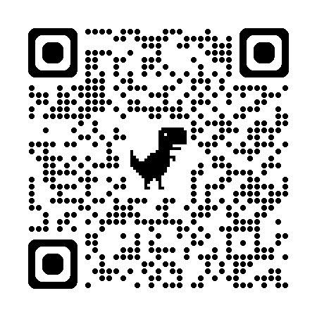
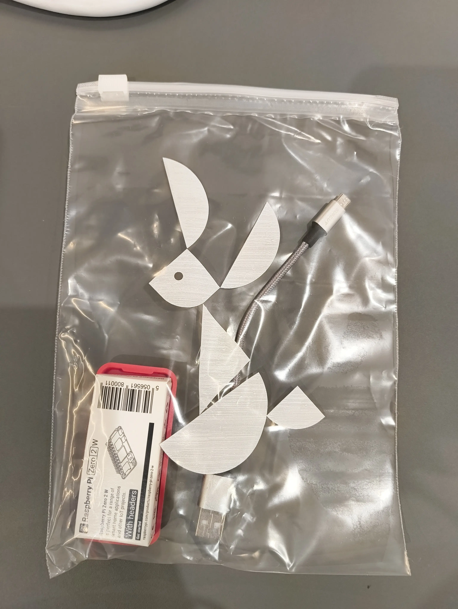

# 2025-08-18 ハンズオン

---


---

# Raspberry Pi Zero 版 CHIRIMEN ハンズオン

WebDINO Japan シニアエンジニア
[渡邉浩平](https://scrapbox.io/intro-to-web-dev/watanabe)

---

> **「モノのインターネット」を見たら、「人のインターネット」に変えていこう。**

台湾元デジタル担当大臣 オードリー・タン

---

## プロフィール


**渡邉浩平 (わたなべ こうへい)**
一般社団法人 WebDINO Japan シニアエンジニア

1992 年生まれ。岡山県総社市出身。鳥取大学工学部卒。専攻は電気電子工学。
2019 年より WebDINO Japan でエンジニアとして従事。Web 技術を軸にソフトウェアシステムのコンサルティングから設計、構築、開発、運用まで担当。
OSS を組み合わせたりして遊ぶおじさん。

---

## CHIRIMEN とは


**プロトタイピング環境**

JavaScript からハードウェアを制御
センサーやモーターなど組み合わせた
さまざまなものをつくることができる!

**オープンな仕様**

- 利用者が自由に開発に携われる!
- 無償で閲覧可能・誰でも参加可能
- ⇆ 一般的な IoT のイメージ
  - 例: スマートスピーカーの消費者

<!-- NOTE: 10-20年前は難しいプログラミングが必要でしたが、今はJavaScriptから簡単に作れるようになりました。 -->
<!-- NOTE: 具体的にはWeb GPIO APIやWeb I2C APIと呼ばれるオープンな仕様に支えられているオープンソースソフトウェアです。 -->

---


<!-- NOTE: CHIRIMENを使い、アイディアを凝らしてさまざまな作品を作っています。 -->

<!-- _footer: 画像の引用元: Web×IoT メイカーズチャレンジ 作品ギャラリー https://webiotmakers.github.io/gallery/ -->

---

## 本日の内容

Raspberry Pi Zero 版 CHIRIMEN 導入編

- 11:15 [Hello Real World（L チカを実行する）](https://tutorial.chirimen.org/pizero/chapter_3.html)
- 12:00 〜休憩〜
- 13:00 CHIRIMEN チュートリアル
  - [GPIO を試す](https://tutorial.chirimen.org/pizero/chapter_4.html)
  - [I2C デバイスを試す](https://tutorial.chirimen.org/pizero/chapter_5.html)
  - [IoT を試す](https://tutorial.chirimen.org/pizero/chapter_6.html)
  - [常駐プログラム化する](https://tutorial.chirimen.org/pizero/chapter_7.html)
- 16:20 片付け (明日も使うので機材はそのままで構いません)

---

## 本日のゴール

センサーやモーターの使い方を理解する


---

## Slack にアクセス


https://webiotmakerschallenge.slack.com

- 参加者のみなさま 👉 `#2025年度-信州参加者`

---

## CHIRIMEN チュートリアル資料

https://tutorial.chirimen.org/pizero/ にアクセス

または

[`chirimen pizero`](https://www.google.com/search?q=chirimen+pizero) で検索 🔍

---

## 困ったとき・分からないとき・気になることがあるとき

Slack や会場にいるスタッフにお気軽にお声がけください :relaxed:

---

## 機材の確認


<!-- _footer: https://tutorial.chirimen.org/pizero/chapter_2-1 -->

---

## Raspberry Pi Zero の起動


1. microSD カードを差し込む
1. 専用ケースに入れる (オプション)
1. パソコンと USB ケーブルで接続する

---

## ターミナルに接続

https://chirimen.org/PiZeroWebSerialConsole/PiZeroWebSerialConsole.html

1. ターミナルにアクセス
2. [Connect and Login PiZero] を選択
3. [接続]


このような画面の表示があれば「接続」をクリック ✅

<!-- _footer: https://tutorial.chirimen.org/pizero/chapter_2-2 -->

---

## Wi-Fi の設定

1. [wifi panel] > [SSID] [PASS PHRASE] を入力
2. [SET WiFi] を選択
3. [wifi Info] を選択して接続の確認
   - 青字で "Raspberry Pi's IP Address: \*\*\*" が表示されていれば OK ✅
   - "Fail to connect chirimen.org." と表示されている場合 → NG ❌
   - もう一度 1. からやり直す

---

## フリーズしたときは再起動

1. USB ケーブルを抜く (電源 OFF)
1. (もう一度) USB ケーブルを接続し起動
1. ターミナルの画面をリロード (🔁 ボタン・`Ctrl`+`R`・`F5` キーなど)
1. [Connect and Login PiZero] を選択
   - シリアルポートが表示されていれば OK ✅
   - 起動完了まで約 2 分間かかります
1. (もう一度) [接続]

<!-- _footer: https://tutorial.chirimen.org/pizero/chapter_2-3 -->

---

## ブレッドボードでの配線


<!-- _footer: https://tutorial.chirimen.org/pizero/chapter_3-1 -->

---

## プログラムを書く

[myApp] > [移動] > [Create New Text] > "hello.js" と入力

```js
import { requestGPIOAccess } from "node-web-gpio"; // WebGPIO を使えるようにするためのライブラリをインポート
const sleep = (msec) => new Promise((resolve) => setTimeout(resolve, msec)); // sleep 関数を定義

const gpioAccess = await requestGPIOAccess(); // GPIO を操作する
const port = gpioAccess.ports.get(26); // 26 番ポートを操作する

await port.export("out"); // ポートを出力モードに設定

// 無限ループ
for (;;) {
  // 1秒間隔で LED が点滅します
  await port.write(1); // LEDを点灯
  await sleep(1000); // 1000 ms (1秒) 待機
  await port.write(0); // LEDを消灯
  await sleep(1000); // 1000 ms (1秒) 待機
}
```

コピー&ペースト > [Save] (保存)

---

## プログラムの実行

"hello.js" を実行する方法

```
node hello.js
```

停止するには `Ctrl`+`C`

書式:

```
node [ファイル名]
```

---

## サンプルコードのダウンロード

CHIRIMEN panel > Get Examples > hello-real-world (L チカ) > JS GET

他のサンプルコードや配線図を参照することができます

---

## ここまでのまとめ

- Raspberry Pi Zero W のセットアップ
- LED を制御するプログラム (通称 LED チカチカ、L チカ) の実行

---

## CHIRIMEN チュートリアル資料

https://tutorial.chirimen.org/pizero/ にアクセス

または

「chirimen pizero」で検索 [🔍](https://www.google.com/search?q=chirimen+pizero)

---

# 2025-08-19

---

## いろいろなデバイスを自由に試してみよう

- 自由に進めてもらって OK 👌
- 自由に実験しながらセンサー・アクチュエータに触れる時間

---

## 本日の流れ

- 10:00 Raspberry Pi Zero 版 CHIRIMEN 応用編・自由時間
- 11:20 片付け・ハッカソンのルール説明

---

## ハッカソンのポイント

作品の完成度より
**やりたいことを実現すること**が大切

<!-- NOTE: 昨日・今日と技術的な話を中心にやってきましたが、極端な話ハッカソンの本番は、技術的に優れているかどうかは一旦忘れてもらってOK、コピペでOK、人の真似でOK
ですが限られた時間しかないので、これからの時間で、やりたいことを周りのスタッフに相談したり、Slackで相談してみてください
 -->


<!-- _footer: 画像の引用元: Web×IoT メイカーズチャレンジ 作品ギャラリー https://webiotmakers.github.io/gallery/ -->

---

## Q. 何を作っていいか分からない

---

## 【参考】過去の作品ギャラリー

「Web×IoT メイカーズチャレンジ」で検索 > ハッカソン作品集
または
https://webiotmakers.github.io/gallery/

---

## 【参考】CHIRIMEN 対応デバイスの一覧

https://tutorial.chirimen.org/partslist

こちらに掲載がないデバイスについても「〇〇をやりたい」「〇〇できるか気になる」などあればご相談ください

---

## 「何を作っていいか分からない」人向け

- AI に聞く
  - Web と AI の膨大な「知識」を活用すれば OK
  - 眼の前の課題をテーマにすればモチベーションが上がる
  - ちょっと足してみたり、自分なりにアレンジしてみたくなる
- できることを増やしていく
  - できることが増えると、やりたいことも増える
  - 世界も広がる
  - だから作ってみよう

---

## ハッカソンに向けて

**やりたいことを実現すること**が大切

- Slack にてお気軽にご相談お寄せください
- メンターに相談するのも OK
- 参加者同士で相談し合うのも OK

---

> **「モノのインターネット」を見たら、「人のインターネット」に変えていこう。**

台湾元デジタル担当大臣 オードリー・タン

---

## I2C で複数のデバイスを扱う

それぞれのデバイスの VCC/GND/SDA/SCL を並列接続

※ 画像にある I2C デバイスはあくまで例です
スレーブアドレスが同じデバイスは同時に接続できません

---

一定温度を超えたとき NeoPixel LED を点灯する例

```js
import { requestI2CAccess } from "node-web-i2c";
import SHT30 from "@chirimen/sht30"; // 温湿度センサー SHT30
import NPIX from "@chirimen/neopixel-i2c"; // NeoPixel I2C

const i2cAccess = await requestI2CAccess();
const port = i2cAccess.ports.get(1);
const sht30 = new SHT30(port, 0x44);
await sht30.init();
const npix = new NPIX(port, 0x41);
await npix.init(8);

while (true) {
  const { temperature } = await sht30.readData();
  console.log(`${temperature.toFixed(2)} ℃`);

  if (temperature > 30) {
    await npix.setGlobal(20, 20, 0);
  } else {
    await npix.setGlobal(0, 0, 0);
  }
}
```

<!-- _footer: 配線図省略 - コードをもとに想像して試してみよう！ -->

<!-- ---

## I2C で複数のデバイスを扱う - 距離センサーと NeoPixel の例

指定の距離を下回ると NeoPixel LED を点灯する例:

```js
import { requestI2CAccess } from "node-web-i2c";
import VL53L0X from "@chirimen/vl53l0x";
import NPIX from "@chirimen/neopixel-i2c";

const i2cAccess = await requestI2CAccess();
const port = i2cAccess.ports.get(1);

const vl53l0x = new VL53L0X(port, 0x29);
await vl53l0x.init();

const npix = new NPIX(port, 0x41);
await npix.init(8);

while (true) {
  const distance = await vl53l0x.getRange();
  console.log(`${distance} mm`);

  if (distance < 100) {
    await npix.setGlobal(100, 100, 100);
  } else {
    await npix.setGlobal(0, 0, 0);
  }
}
``` -->

---

## ⚠ Raspberry Pi のカメラに関する注意事項

- 接続端子・フラットケーブルは壊れやすい
  - 引っ張らない
  - 折り曲げない

**動作確認方法**

以下のコマンドで画像ファイルが保存されます:

```
raspistill -v --width 640 --height 480 -o test.jpg
```

---

## ⚠ 片付け注意事項

借りた電子部品は返却しましょう



- Raspberry Pi Zero W
- USB ケーブル
- 各種貸し出しデバイス

(詳しくは会場のスタッフに)

---

## 【参考】材料調達 Tips

> ネットショップ購入のリードタイムに注意。初動が重要。

https://gist.github.com/elie-j/8a27e7a65a40371e0cda5754ce0a063d

---

## 過去の資料

- [2023 年度 岡山版](/chirimen-hands-on/2023/okayama/)
- [2022 年度 東京版](/chirimen-hands-on/2022/tokyo/)
- [2022 年度 岡山版](/chirimen-hands-on/2022/okayama/)
- [2022 年度 愛媛版](/chirimen-hands-on/2022/ehime/)

---

## フィードバック

[このスライドを編集する](https://github.com/kou029w/chirimen-hands-on/edit/main/README.md) / [問題を報告する](https://github.com/kou029w/chirimen-hands-on/issues/new)

<script type="module">
document.querySelectorAll("a").forEach(function (a) {
  Object.assign(a, {
    target: "_blank",
    rel: "noreferrer",
  });
});
</script>
