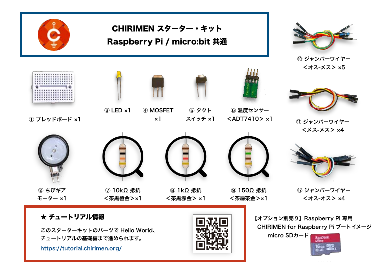

---

# CHIRIMEN ハンズオン

2022-10-08/2022-10-09 in 岡山

WebDINO Japan シニアエンジニア
[渡邉浩平](https://github.com/kou029w)

---

## 本日の流れ

準備編 (11:20-12:00)

- セットアップ
- L チカしてみよう

基礎編 (13:00-17:00)

- GitHub アカウントの登録
- GPIO に関する基礎知識
- I2C に関する基礎知識

応用編

- いろいろなデバイスを試してみよう

---

## CHIRIMEN とは

Web ブラウザーからハードウェアを制御するプロトタイピング環境
センサーやモーターなど組み合わせたさまざまなものをつくることができます

---

## 作品例

<!-- _footer: 画像の引用元: Web×IoT メイカーズチャレンジ 作品ギャラリー https://webiotmakers.github.io/gallery/ -->

---

## 本日のゴール

基礎編

- センサーやモーターの基本的な使い方を理解する

---

## Slack にアクセス (まだの方)

[webiotmakerschallenge.slack.com](https://webiotmakerschallenge.slack.com)

---

## 困ったとき・分からないとき・気になることなど

チューターやメンターにお気軽にお声がけください 🖐

---

## ハンズオン資料

[tutorial.chirimen.org/raspi](https://tutorial.chirimen.org/raspi/)
または
「pi chirimen」で検索

---

## CHIRIMEN スターターキットの確認

<!-- _footer: https://tutorial.chirimen.org/raspi/section0#section-1 -->

---

## Raspberry Pi の起動

<!-- _footer: https://tutorial.chirimen.org/raspi/section0#chirimen-for-raspberry-pi--1 -->

---

## Wi-Fi の設定

Raspberry Pi の起動後、画面右上のパネルをクリックして設定を行います

(接続情報は会場で確認しましょう)

<!-- _footer: https://tutorial.chirimen.org/raspi/section0#wifi- -->

---

## ブレッドボードでの配線

<!-- _footer: https://tutorial.chirimen.org/raspi/section0#section-7 -->

---

## サンプルコードの実行

ブラウザー > Examples > GPIO Examples > GPIO-Blink > CSB (CodeSandbox)

<!-- _footer: CHIRIMEN Examples https://chirimen.org/chirimen/gc/top/examples/ -->

---

## ここまでのまとめ

- CHIRIMEN for Raspberry Pi の起動
- LED を制御するサンプルコード (通称 LED チカチカ、L チカ) の実行

---

## 後付

---

## GitHub のアカウント登録

[GitHub > Sign up](https://github.com/signup) からアカウントを作成します。
アカウントに必要な項目を入力します。

---

## GitHub のアカウント登録

<!-- _footer: Join GitHub https://github.com/signup -->

---

## GitHub のアカウント登録

入力したメールアドレスに登録用のメールが届くので確認します。

<!-- _footer: Join GitHub https://github.com/signup -->

---

## GitHub のアカウント登録

次のような画面になれば OK です。

<!-- _footer: GitHub https://github.com/ -->

---

## CodeSandbox の使い方

- [CodeSandbox の基本的な使い方](https://csb-jp.github.io/docs/usage)

---

## その他

- [デバッグ・トラブルシューティング](https://tutorial.chirimen.org/raspi/debug)
- [Tips・テクニック](https://tutorial.chirimen.org/raspi/tips)
- [良くある質問と回答](https://tutorial.chirimen.org/raspi/faq)
