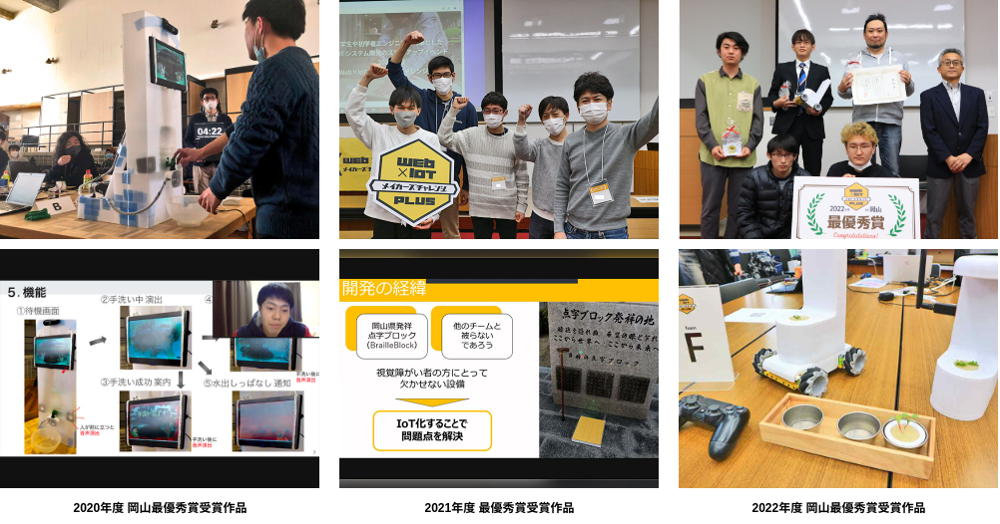
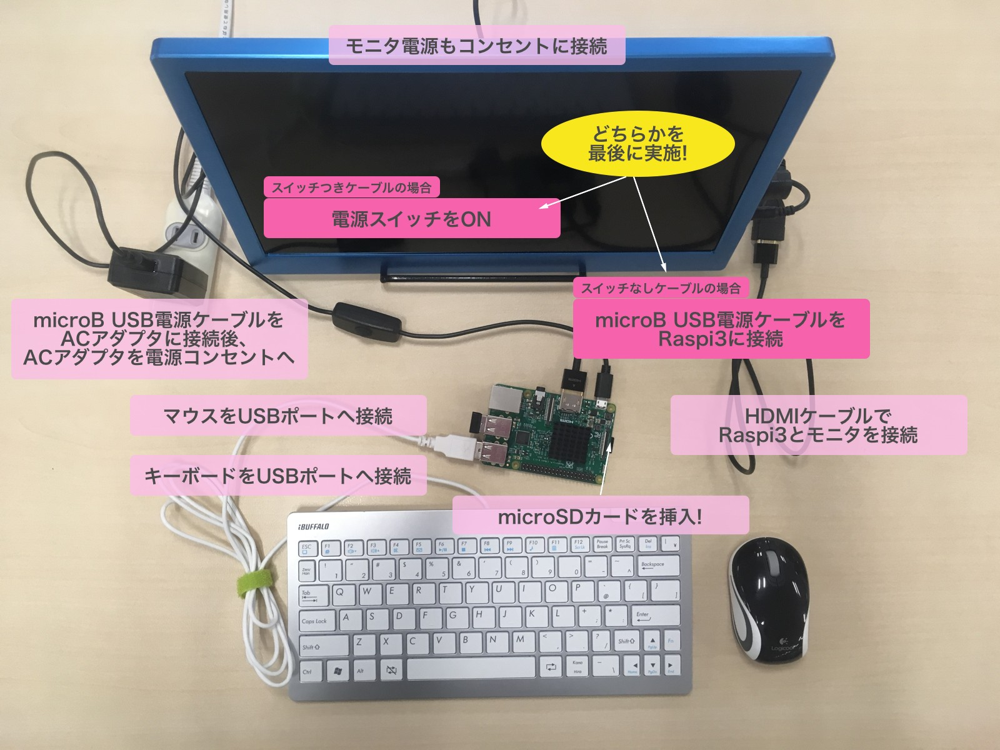
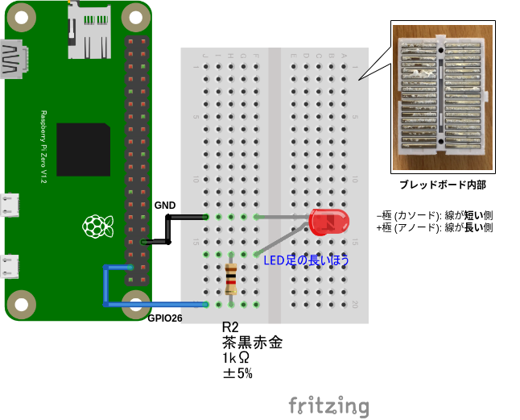
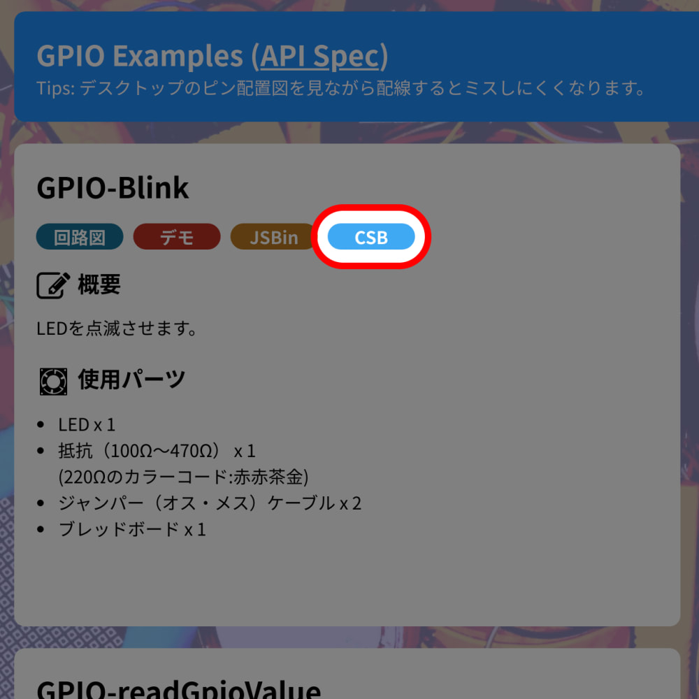
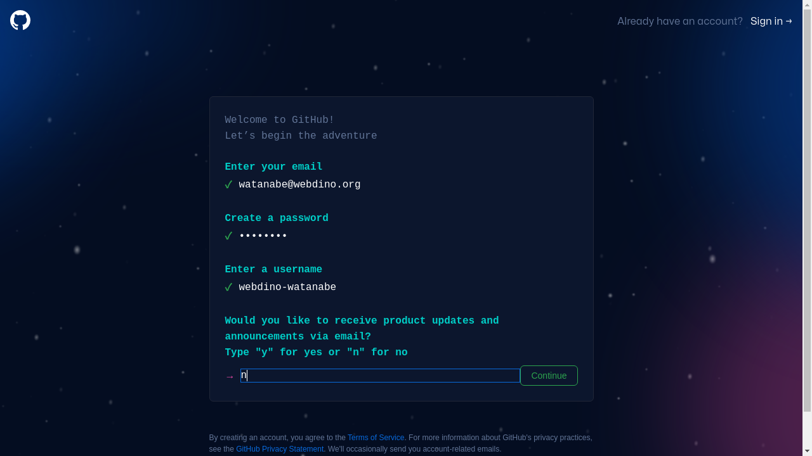
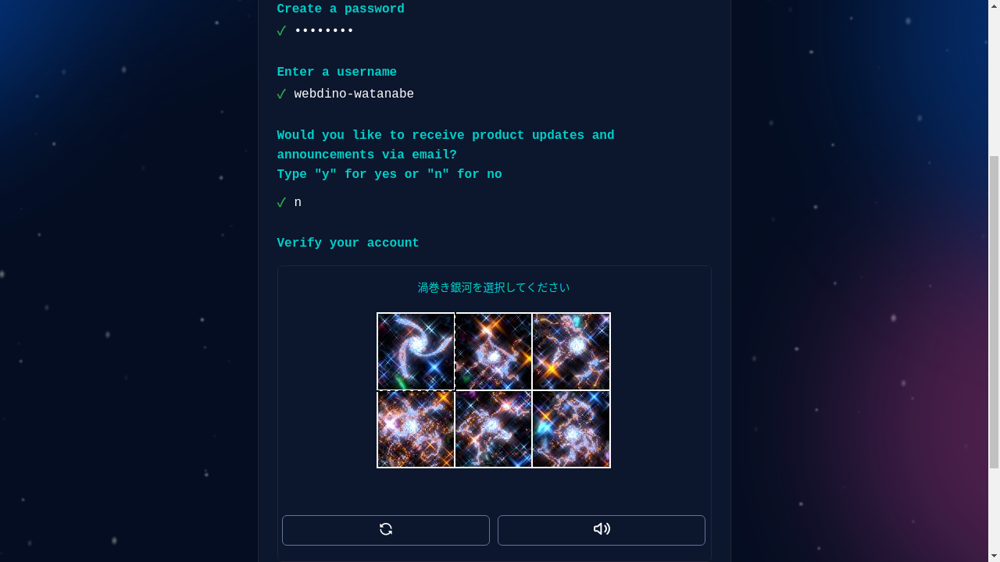
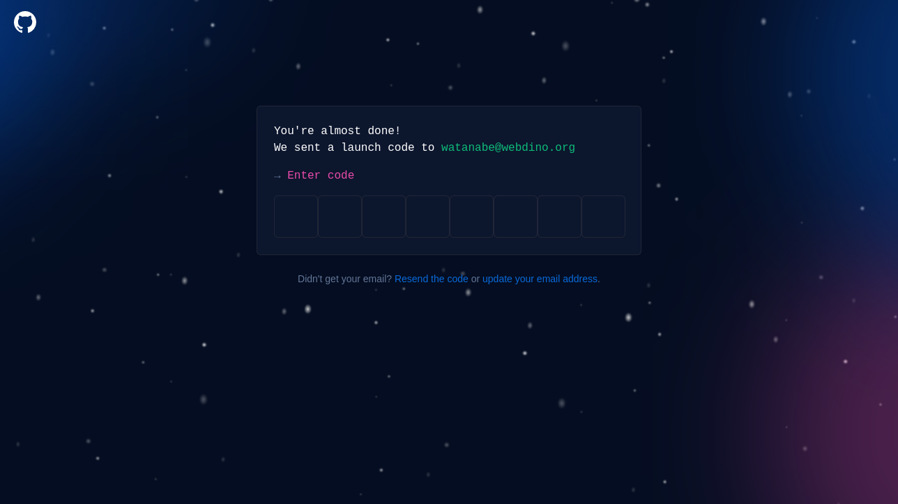
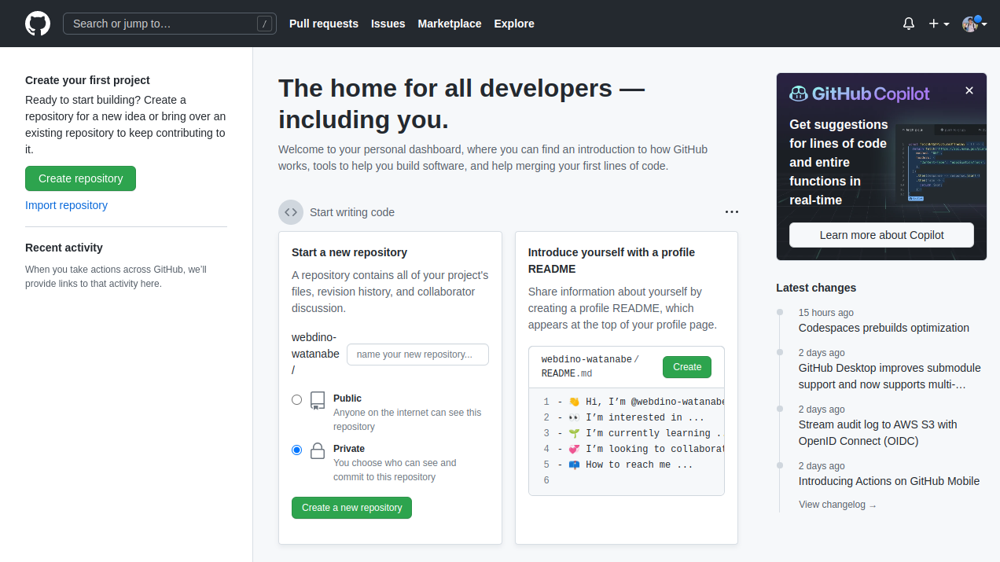

# 1 日目

---

---

# CHIRIMEN ハンズオン

2022-10-08/2022-10-09 in 岡山

WebDINO Japan シニアエンジニア
[渡邉浩平](https://github.com/kou029w)

---

## CHIRIMEN とは

Web ブラウザーからハードウェアを制御するプロトタイピング環境
センサーやモーターなど組み合わせたさまざまなものをつくることができます

---

## 作品例

<!-- _footer: 画像の引用元: Web×IoT メイカーズチャレンジ 作品ギャラリー https://webiotmakers.github.io/gallery/ -->

---

## 本日の流れ

準備編 (11:20-12:00)

- セットアップ

基礎編 (13:00-17:00)

- L チカしてみよう
- GitHub アカウントの登録
- GPIO に関する基礎知識
- I2C に関する基礎知識

---

## 本日のゴール

基礎編

- センサーやモーターの基本的な使い方を理解する

---

## Slack にアクセス (まだの方)

[webiotmakerschallenge.slack.com](https://webiotmakerschallenge.slack.com)

---

## ハンズオン資料

[tutorial.chirimen.org/raspi](https://tutorial.chirimen.org/raspi/)
または
「chirimen チュートリアル」で検索

---

## 困ったとき・分からないとき・気になることがあるとき

会場のスタッフにお気軽にお声がけください 🖐
(Slack でも OK 👌)

---

## 機材の確認

必要なもの

- クリアボックス
  - ディスプレイ/HDMI ケーブル/変換アダプター/AC アダプター (Type-C)
  - AC アダプター付き電源タップ/Type-C ケーブル
  - Raspberry Pi 本体/ヒートシンク
  - 有線マウス
- キーボード
- CHIRIMEN スターターキット
  - microSD カード

(必要なもの以外はクリアボックスに片付けておきましょう)

<!-- _footer: https://tutorial.chirimen.org/raspi/section0#section-1 -->

---

## ヒートシンクの取り付け

> 

<!-- _footer: 画像の引用元: Get started with your OKdo Pi Kit in a flash - OKdo https://www.okdo.com/getstarted/ -->

---

## Raspberry Pi の起動

<!-- _footer: https://tutorial.chirimen.org/raspi/section0#chirimen-for-raspberry-pi--1 -->

---

## Wi-Fi の設定

Raspberry Pi の起動後、画面右上のパネルをクリックして設定を行います

(接続情報は会場で確認しましょう)

<!-- _footer: https://tutorial.chirimen.org/raspi/section0#wifi- -->

---

## ブレッドボードでの配線

<!-- _footer: https://tutorial.chirimen.org/raspi/section0#section-7 -->

---

## サンプルコードの実行

ブラウザー > Examples > GPIO Examples > GPIO-Blink > CSB (CodeSandbox)

<!-- _footer: CHIRIMEN Examples https://chirimen.org/chirimen/gc/top/examples/ -->

---

## ここまでのまとめ

- CHIRIMEN for Raspberry Pi の起動
- LED を制御するサンプルコード (通称 LED チカチカ、L チカ) の実行

---

## GitHub アカウントの登録

---

## GitHub アカウントの登録

[GitHub > Sign up](https://github.com/signup) からアカウントを作成します
アカウントに必要な項目を入力します

---

## GitHub アカウントの登録

<!-- _footer: Join GitHub https://github.com/signup -->

---

## GitHub アカウントの登録

入力したメールアドレスに登録用のメールが届くので確認します

<!-- _footer: Join GitHub https://github.com/signup -->

---

## GitHub アカウントの登録

次のような画面になれば OK

<!-- _footer: GitHub https://github.com/ -->

---

## CodeSandbox の使い方

- [CodeSandbox の基本的な使い方](https://csb-jp.github.io/docs/usage)

---

## 後付

---

## その他

- [デバッグ・トラブルシューティング](https://tutorial.chirimen.org/raspi/debug)
- [Tips・テクニック](https://tutorial.chirimen.org/raspi/tips)
- [良くある質問と回答](https://tutorial.chirimen.org/raspi/faq)

---

# 2 日目

---

## いろいろなデバイスを触ってみよう

自分の席に着き次第、自由に進めてもらって OK 👌

---

## 本日の流れ

ハンズオン講習会

- 10:00-10:10 はじめに
- 11:30-12:00 片付け

アイディアワークショップ

- 13:00-13:30 インプットトーク
- 13:30-16:00 各チームの作戦会議
- 16:00-16:20 各チームの進捗共有
- 16:30-17:00 ハッカソンの説明など

---

## ハッカソンのポイント

- ときめくような素敵なアイディア
- 審査本番に作品が機能すること

<!-- NOTE: 昨日・今日と技術的な話を中心にやってきましたが、極端な話ハッカソンの本番は、技術的に優れているかどうかは一旦忘れてもらってOK、コピペでOK、人の真似でOK
ですが限られた時間しかないので、これからの時間で、やりたいことを周りのスタッフに相談したり、Slackで相談してみてください
 -->

<!-- _footer: 画像の引用元: Web×IoT メイカーズチャレンジ 作品ギャラリー https://webiotmakers.github.io/gallery/ -->

---

## 応用編

- I2C で複数のデバイス扱う
- 遠隔制御

---

## I2C で複数のデバイス扱う

それぞれのモジュールの VCC/GND/SDA/SCL を並列接続

スレーブアドレスが同じデバイスは同時に接続できません
https://tutorial.chirimen.org/raspi/section3#section-7

---

## I2C で複数のデバイス扱う - 温湿度センサーと距離センサーの例

<iframe src="https://codesandbox.io/embed/sht30-vl53l0x-pz620y?autoresize=1&codemirror=1&fontsize=14&hidenavigation=1&theme=dark"
  style="width:100%; height:500px; border:0; border-radius: 4px; overflow:hidden;"
  title="sht30-vl53l0x"
  allow="accelerometer; ambient-light-sensor; camera; encrypted-media; geolocation; gyroscope; hid; microphone; midi; payment; usb; vr; xr-spatial-tracking"
  sandbox="allow-forms allow-modals allow-popups allow-presentation allow-same-origin allow-scripts"
></iframe>

---

## 遠隔制御

ブラウザー > Examples > Remote Examples > REMOTE-I2C-SHT30 > CSB

- `relay.subscribe("{ここは書き換えて使用してください}")`

---

## ⚠ 片付け注意事項

1. 借りたセンサーをすべて返却します
1. Raspberry Pi の電源を切ります
1. microSD カードは必ず抜き取り、CHIRIMEN スターターキットを片付けます
1. クリアボックスを片付けます
   - できるだけ元の状態に戻してください

(詳しくは会場のスタッフが案内します)

---

## ハッカソンに向けて

リードタイムに注意 特に海外からの発送は時間がかかるので余裕を持って
品薄なものもあるので早めに調達を
https://gist.github.com/elie-j/8a27e7a65a40371e0cda5754ce0a063d
