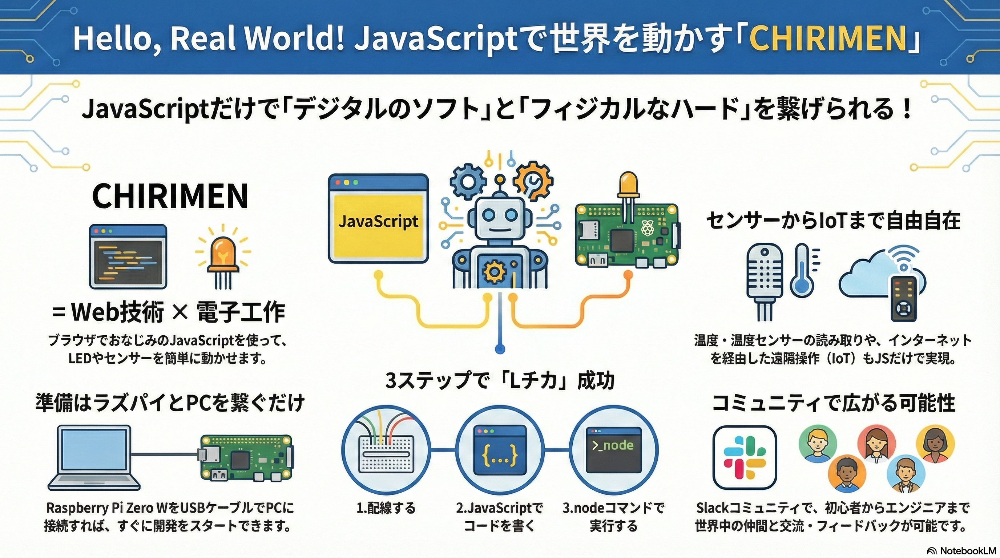
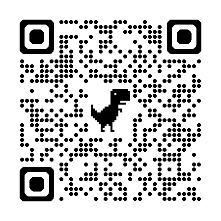
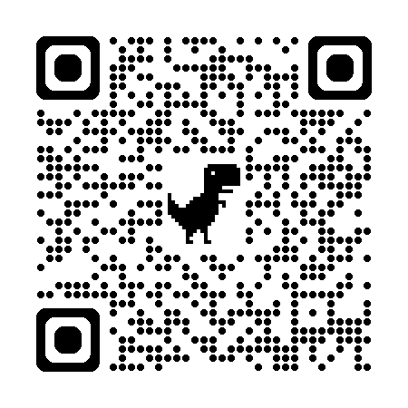
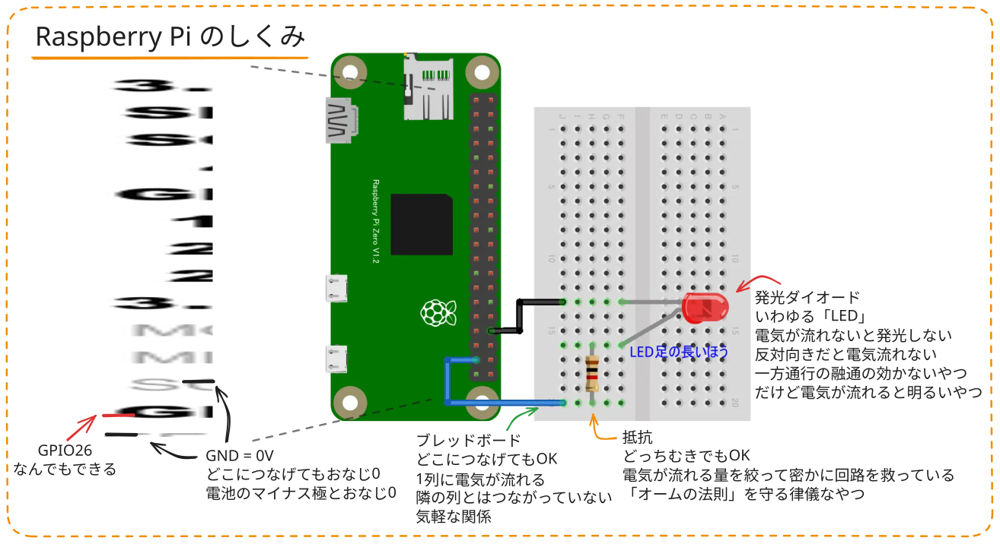
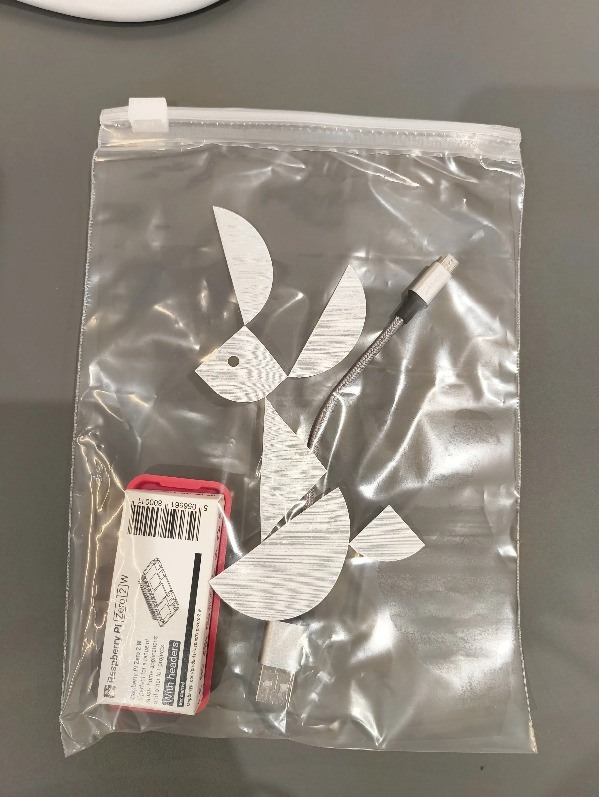

# 2026-08-08 ハンズオン

---


---

# Raspberry Pi Zero 版<br>CHIRIMEN ハンズオン

WebDINO Japan エンジニア
[渡邉浩平](https://scrapbox.io/intro-to-web-dev/watanabe)

むずかしい言葉が出てきたら、お気軽にご質問ください :relaxed:

---

## プロフィール


**<ruby>渡邉<rt>わたなべ</rt></ruby><ruby>浩平<rt>こうへい</rt></ruby>**
一般社団法人 WebDINO Japan エンジニア

1992 年生まれ。岡山県<ruby>総社市<rt>そうじゃし</rt></ruby>出身。鳥取大学工学部卒。
2019 年から WebDINO Japan で、Web の仕事をしています。
OSSを組み合わせてコンピューターで遊ぶのが好きです。

---



<!-- NOTE: 10-20年前は難しいプログラミングが必要でしたが、今はJavaScriptから簡単に作れるようになりました。 -->
<!-- NOTE: 具体的にはWeb GPIO APIやWeb I2C APIと呼ばれるオープンな仕様に支えられているオープンソースソフトウェアです。 -->

---

## 本日の内容

<ruby>CHIRIMEN<rt>ちりめん</rt></ruby> ワークショップ

- 13:45 [Hello Real World 〜LEDを光らせてみよう〜](https://chirimen.org/pizero/chapter_3.html)
- 〜休憩〜
- 14:35 CHIRIMEN チュートリアル
  - [GPIO を試す](https://chirimen.org/pizero/chapter_4.html)
  - [I2C デバイスを試す](https://chirimen.org/pizero/chapter_5.html)
  - [IoT を試す](https://chirimen.org/pizero/chapter_6.html)
  - [AIアシスタントを活用する](https://chirimen.org/pizero/using-ai-assistant)
- 17:30 DAY 1 終了

---

## 本日のゴール

CHIRIMENでセンサーやモーターを動かして電子工作を楽しもう


---

## Slack にアクセス


https://webiotmakerschallenge.slack.com

👉 `2026年度-岡山参加者`

---

## CHIRIMEN チュートリアル資料



https://chirimen.org/pizero/ にアクセス

または [chirimen pizero で検索 🔍](https://www.google.com/search?q=chirimen+pizero)

---

## 困ったとき・分からないとき

Slack や会場のスタッフに気軽に声をかけてください :relaxed:

---

## 用意するもの


<!-- _footer: https://chirimen.org/pizero/chapter_2-1 -->

---

## Raspberry Pi Zero の起動


1. microSD カードを差し込む
1. 専用ケースに入れる (オプション)
1. パソコンと USB ケーブルで接続する

---

## ターミナルに接続

https://chirimen.org/PiZeroWebSerialConsole/PiZeroWebSerialConsole.html

1. ターミナルにアクセス
2. [Connect and Login PiZero] を選択
3. [接続]


このような画面が出たら「接続」をクリック ✅

<!-- _footer: https://chirimen.org/pizero/chapter_2-2 -->

---

## Wi-Fi の設定

1. [wifi panel] > [SSID] [PASS PHRASE] を入力
2. [SET WiFi] を選択
3. [wifi Info] を選択して接続を確認

- 青字で "Raspberry Pi's IP Address: \*\*\*" が出たら OK ✅
- "Fail to connect chirimen.org." が出たら NG ❌
- もう一度 1. からやり直す

---

## フリーズしたときは再起動

1. USB ケーブルを抜く (電源 OFF)
1. (もう一度) USB ケーブルを接続して起動
1. ターミナルの画面をリロード (🔁 ボタン・`Ctrl`+`R`・`F5` キーなど)
1. [Connect and Login PiZero] を選択
   - シリアルポートが表示されていれば OK ✅

- 起動完了まで約 2 分かかります

1. (もう一度) [接続]

<!-- _footer: https://chirimen.org/pizero/chapter_2-3 -->

---

## ブレッドボードでの配線

https://chirimen.org/pizero/chapter_3-1

---



---

## プログラムを書く

[myApp] > [移動] > [Create New Text] > "hello.js" と入力

```js
import { requestGPIOAccess } from "node-web-gpio"; // WebGPIO を使えるようにするためのライブラリをインポート
const sleep = (ms) => new Promise((resolve) => setTimeout(resolve, ms)); // sleep 関数を定義

const gpioAccess = await requestGPIOAccess(); // GPIO を操作する
const port = gpioAccess.ports.get(26); // 26 番ポートを操作する

await port.export("out"); // ポートを出力モードに設定

// 無限ループ
while (true) {
  // 1秒間隔で LED が点滅します
  await port.write(1); // LEDを点灯
  await sleep(1000); // 1000 ms (1秒) 待機
  await port.write(0); // LEDを消灯
  await sleep(1000); // 1000 ms (1秒) 待機
}
```

コピー&ペースト > [Save] (保存)

---

## プログラムの実行

"hello.js" を実行する方法

```
node hello.js
```

止めるには `Ctrl`+`C`

書式:

```
node [ファイル名]
```

---

## サンプルコードのダウンロード

CHIRIMEN panel > Get Examples > hello-real-world (L チカ) > JS GET

ほかのサンプルコードや配線図を見られます

---

## ここまでのまとめ

- Raspberry Pi Zero W のセットアップ
- LED を制御するプログラム (通称 LED チカチカ、L チカ) の実行

---

# 2026-08-09

---

## 本日の流れ

- 10:00 CHIRIMEN チュートリアルの続き・自由時間
- 11:20 片付け・チーム分け発表
- 11:35 アイスブレイク

---

## 自由時間

前日のチュートリアルの続きをやってみよう

- Example 集を見ながらいろいろなデバイスを試す、または自分の好きなものを作ってみよう
- デバイス決める 👉 [応用センサーキットの使い方](https://chirimen.org/pizero/chapter_8-1) を読みながら試す
- 自分のペースで進めて OK 👌

---

## ⚠ 片付け注意事項

借りた機材は返却しましょう



- Raspberry Pi・USB ケーブル (SD カードの抜き忘れに注意)
- SD カード
- 応用センサーキットの中身

(詳しくは会場のスタッフに)

---

## ハッカソンに向けてのポイント

**やりたいことを形にすること**が大切

<!-- NOTE: 昨日・今日と技術的な話を中心にやってきましたが、極端な話ハッカソンの本番は、技術的に優れているかどうかは一旦忘れてもらってOK、コピペでOK、人の真似でOK
ですが限られた時間しかないので、これからの時間で、やりたいことを周りのスタッフに相談したり、Slackで相談してみてください
 -->

<!-- _footer: Web×IoT メイカーズチャレンジ 作品ギャラリー https://webiotmakers.github.io/gallery/ -->

---

## 岡山の魅力

---

## 【参考】過去の作品ギャラリー

「Web×IoT メイカーズチャレンジ」で検索 > ハッカソン作品集
または
https://webiotmakers.github.io/gallery/

---

## 【参考】CHIRIMEN 対応デバイスの一覧

https://chirimen.org/partslist

ここにないデバイスでも「〇〇をやりたい」「〇〇できる?」があれば相談してください

---

## 【参考】材料を買うときのヒント

ネットで買うときは届くまでの日数に注意。早めに買って試してみよう。

https://gist.github.com/elie-j/8a27e7a65a40371e0cda5754ce0a063d

---

## ハッカソンに向けて

**やりたいことを形にすること**が大切

- Slack で気軽に相談してください
- メンターに相談するのも OK
- 参加者同士で相談するのも OK

---

## 過去の資料

- [2025 年度 徳島版](/chirimen-hands-on/2025/tokushima/)
- [2025 年度 三重版](/chirimen-hands-on/2025/mie/)
- [2023 年度 岡山版](/chirimen-hands-on/2023/okayama/)
- [2022 年度 東京版](/chirimen-hands-on/2022/tokyo/)
- [2022 年度 岡山版](/chirimen-hands-on/2022/okayama/)
- [2022 年度 愛媛版](/chirimen-hands-on/2022/ehime/)

---

## フィードバック

[このスライドを編集する](https://github.com/kou029w/chirimen-hands-on/edit/main/README.md) / [問題を報告する](https://github.com/kou029w/chirimen-hands-on/issues/new)

<script type="module">
document.querySelectorAll("a").forEach(function (a) {
  Object.assign(a, {
    target: "_blank",
    rel: "noreferrer",
  });
});
</script>

<style>
@import url("https://fonts.googleapis.com/css2?family=Baloo+2:wght@600;700&family=Zen+Maru+Gothic:wght@500;700&display=swap");

:root {
  --bg: #fffaf0;
  --ink: #1f2a44;
  --sun: #ffd54f;
  --sky: #90caf9;
  --leaf: #a5d6a7;
  --coral: #ff8a65;
}

section {
  font-family: "Zen Maru Gothic", "Baloo 2", sans-serif;
  color: var(--ink);
  background:
    radial-gradient(circle at 8% 12%, rgba(255, 213, 79, 0.35) 0 180px, transparent 181px),
    radial-gradient(circle at 92% 18%, rgba(144, 202, 249, 0.35) 0 160px, transparent 161px),
    radial-gradient(circle at 12% 85%, rgba(165, 214, 167, 0.35) 0 170px, transparent 171px),
    radial-gradient(circle at 88% 88%, rgba(255, 138, 101, 0.35) 0 150px, transparent 151px),
    repeating-linear-gradient(45deg, rgba(31, 42, 68, 0.03) 0 8px, rgba(31, 42, 68, 0.01) 8px 16px),
    var(--bg);
  padding: 0 1.25rem;
}

section :is(h1, h2, h3, h4, h5, h6) {
  border-bottom: 0.5rem solid var(--sun);
  display: inline-block;
  padding: 0 0.75rem 0.125rem;
  border-radius: 0.625rem;
  background: rgba(255, 255, 255, 0.75);
  box-shadow: 0.25rem 0.25rem 0 rgba(31, 42, 68, 0.15);
  line-height: 1.2;
}

h1 {
  font-size: 2.2rem;
}

h2 {
  font-size: 1.6rem;
}

p,
li {
  font-size: 1rem;
}

a, a:visited {
  color: #0b75cb;
}

section strong {
  background: linear-gradient(transparent 60%, rgba(255, 213, 79, 0.7) 60%);
  padding: 0 0.25rem;
}

section blockquote {
  border-left: 0.5rem solid var(--sky);
  background: rgba(144, 202, 249, 0.15);
  padding: 0.875rem 1.125rem;
  border-radius: 0.75rem;
  box-shadow: 0.1875rem 0.25rem 0 rgba(31, 42, 68, 0.12);
}

section code {
  background: rgba(255, 255, 255, 0.9);
  border: 0.125rem dashed rgba(31, 42, 68, 0.2);
  border-radius: 0.5rem;
  padding: 0.125rem 0.375rem;
  vertical-align: baseline;
}

section pre {
  border: 0.1875rem solid rgba(31, 42, 68, 0.12);
  border-radius: 1rem;
  box-shadow: 0.25rem 0.375rem 0 rgba(31, 42, 68, 0.15);
  background: rgba(255, 255, 255, 0.92);
  line-height: 1.35;
  font-size: 0.85rem;
}
</style>
